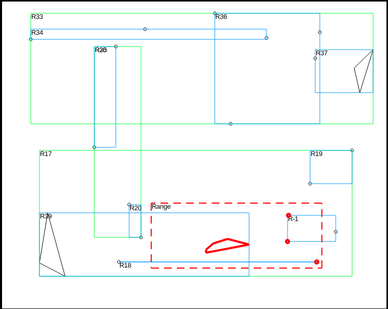
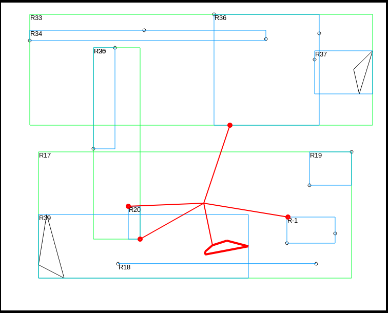

# RTree

Build command:
```
mkdir build
```

```
cmake ..
```

```
make
```
Basic example how to use it, can be found in **source.cpp**  & **test_delete.cpp** files

Store 2D Polygons in R-tree data structure.

**Functions available:**

* Range Query:



* K-Nearest Neghbor Query:


